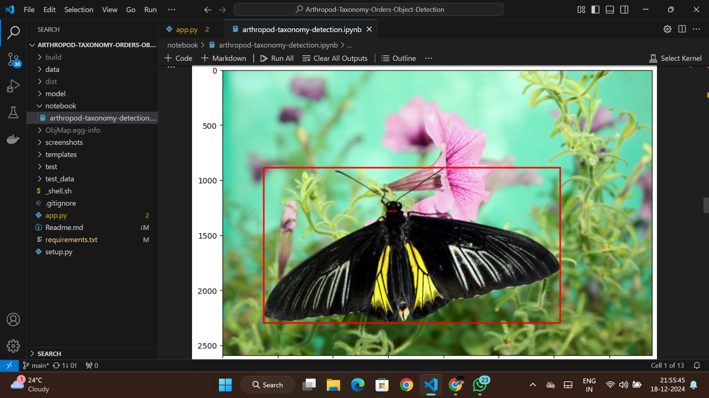
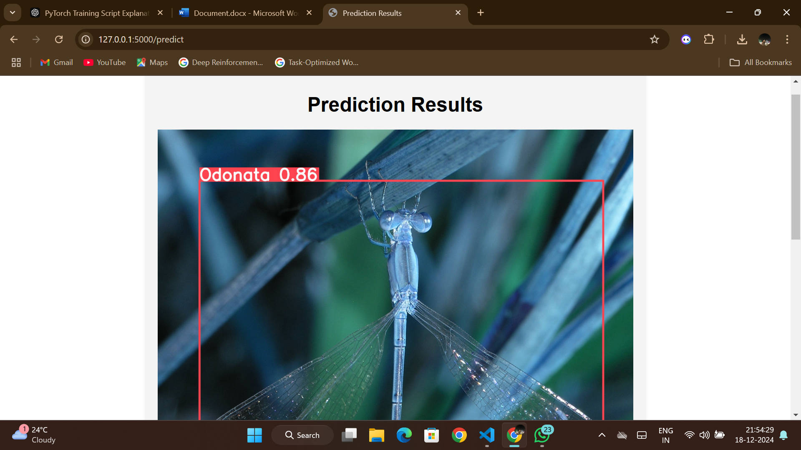
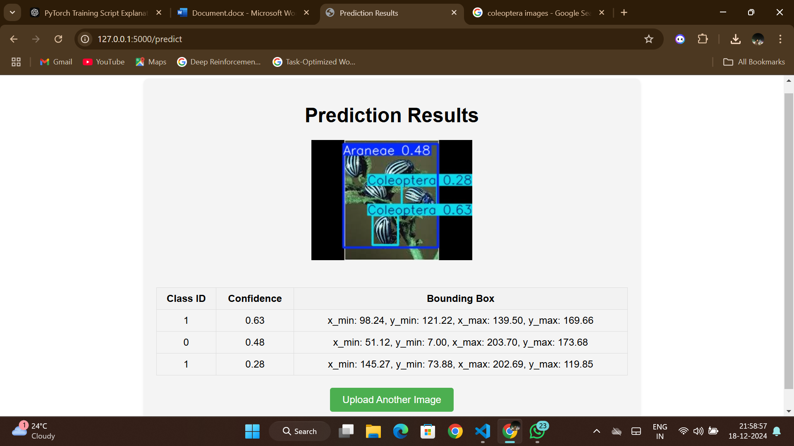

# Arthropod Taxonomy Orders Dataset

## About the Dataset 

### Dataset Overview
Species identification from an image is a complex problem. Image classification assumes there is only one species in the image. However, the goal is to identify **all** species present in an image. Thankfully, biologists and taxonomists have systematically classified and ordered organisms in a taxonomic hierarchy.

The **ArTaxOr** dataset focuses on arthropods, which include insects, spiders, crustaceans, centipedes, millipedes, etc. With over 1.3 million described species of arthropods, creating a single dataset to cover them all is not feasible. Instead, the identification problem is broken down into multiple tasks:

### Content

The dataset consists of images of arthropods in jpeg format and object boundary boxes in json format. There are between one and 50 objects per image.

This dataset is actively maintained, and new orders will be added on a regular basis. Currently, the following orders are covered with at least 2000 objects per order:

Araneae (spiders), adults, juveniles

Coleoptera (beetles), adults

Diptera (true flies, including mosquitoes, midges, crane file etc.), adults

Hemiptera (true bugs, including aphids, cicadas, planthoppers, shield bugs etc.), adults and nymphs

Hymenoptera (ants, bees, wasps), adults

Lepidoptera (butterflies, moths), adults

Odonata (dragonflies, damselflies), adults

#### Dataset Description

---

## Annotation
I have annotated the data using JSON files to provide precise boundary boxes for the objects in each image.

### Annotation Testing
Testing of annotations was performed to ensure accuracy and consistency.

---

## Model Training
The model was trained using **YOLOv8** on an **NVIDIA Tesla T4 GPU** for efficient performance.

---

## Prediction and Testing
For prediction and testing, **Flask** was used to deploy and test the trained model.

### Prediction - Step 1
Initial prediction result:

### Prediction - Final Result
Final refined prediction result:

---

## Pipeline
1. Dataset Annotation
2. Model Training using YOLOv8
3. Deployment using Flask
4. Prediction and Testing
